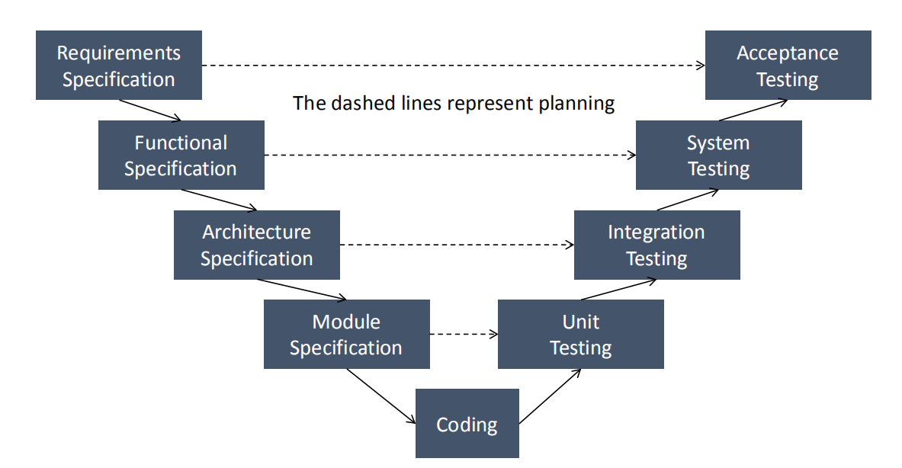
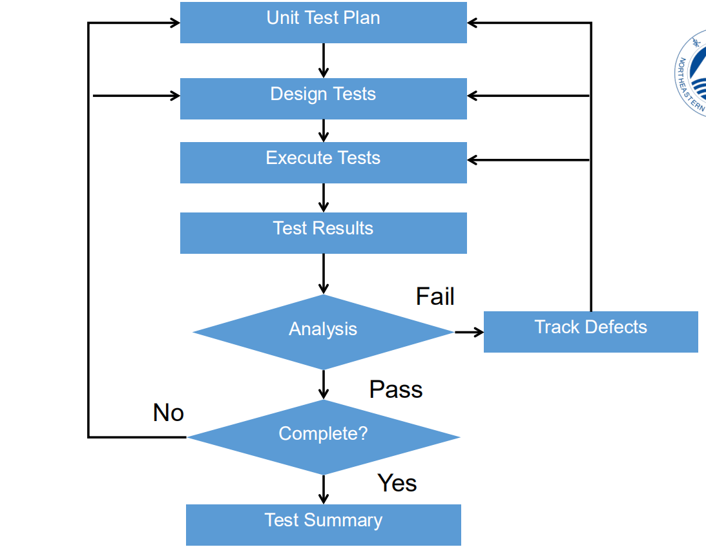
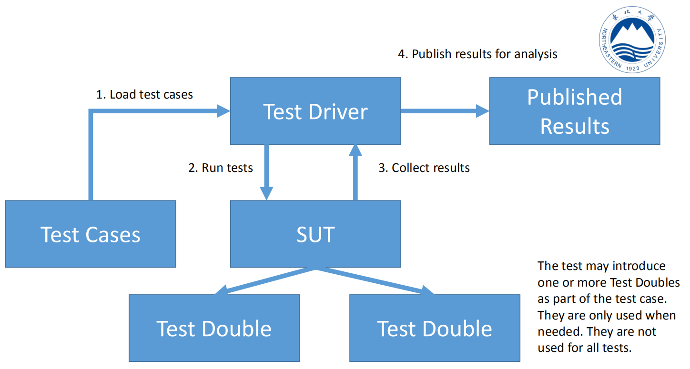
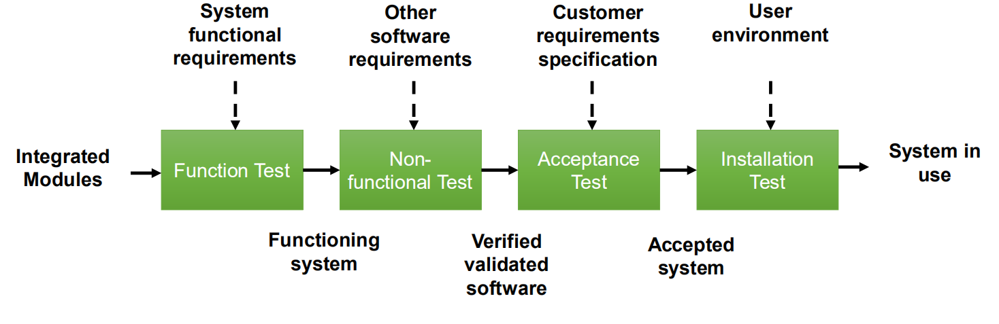
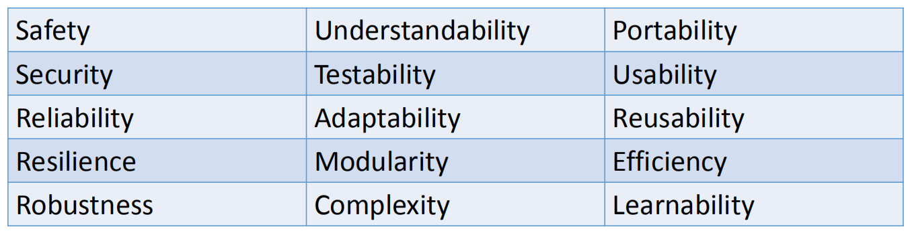
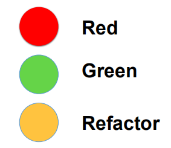

# PPT-Driven Notes of SQAT

See [Mind Map](https://github.com/unbyte/sqat-note/blob/master/mindmap.pdf)

## 1. Introduction to Software QA and Testing

**The Purpose for Testing** is not to prove anything specific, but to **reduce the risk of using the software**

If our goal is to demonstrate that a program has no errors, then we will be steered subconsciously toward this goal; that is, we tend to select test data that have a low probability of causing the program to fail. On the other hand, if our goal is to demonstrate that a program has errors, our test data will have a higher probability of finding errors. The latter approach will add more value to the program than the former.

### Basic Terminology

- Errors (or mistakes) – A problem that is introduced into a system during development. 
- Faults (defects) - A result of an error. 
  - If a designer makes an error that adds something that we don’t want, the fault is incorrect execution. 
  - If a designer makes an error that misses out something, then the fault is something that is not in the software. 
- Failures – The result when a fault executes. 
- Incidents – The symptoms that indicates that there is a fault. 

#### Relationship

System(Errors → Faults → Failures) → User(Incidents)

### TESTING is a vital part of development

- Make sure people build things with right tools and methods
- Make sure the system has a sensible architecture 
- Use walkthroughs to make sure we agree on what is being done and how it is being done 

**TESTING should balance time, money and quality**

### Joel's Example

- Testing checks your daily building
- Testing shows that bugs have been fixed 
- Testing indicates how you are doing against the schedule
- Testing validates development against the specification
- Usability testing checks you are building what users want

### Software Quality Management

Software Quality Management is concerned with ensuring that developed software systems are ‘fit for purpose.’ 

- We need processes and standards that should help a team to develop high-quality products 
- We need to check that the processes and standards have been followed 
- We will be thinking further about Software Quality and how it can be managed

## 2. Black-Box Testing

### Advantage

You don’t need to know how it is implemented, so

- You can plan tests earlier 
- You can write tests earlier 
- You do not need to be the person who implements the code 
- When the implementation changes, the tests should still work 

### Techniques to identify good test values

- Equivalence Partition(Domain)

  - Identify the equivalence classes. 

  - Design a new test case, with a unique ID, that covers a valid equivalence class which has not yet been 

    tested.

    - Repeat this step until all valid equivalence classes are included 

  - Design a new test case, with a unique ID, that covers an invalid equivalence class which has not yet been tested.

    - Repeat this step until all invalid equivalence classes are included 

- Boundary Value Analysis

  - Boundary Value Analysis works well when the variables are independent and represent bounded physical quantities 
    - E.g. good for temperatures, air speed, etc.

- Decision Tables

- Cause-Effect Graphing

- Error guessing

### How complete is the selection of test cases?

**Weak** vs **Strong**

- **Weak** – Assuming a single fault – choose one value and select test cases for each equivalence partition

-  **Strong** – Assuming multiple faults - choose test cases for the combination of equivalence partitions

**Normal** vs **Robust**

- **Normal** – select values from the ‘valid’ ranges 

- **Robust** – select values from the ‘invalid’ ranges

## 3. White-Box Testing

White-box is based on the implementation.

Black-box testing works well to generate for high-level test cases that check the general logic of the application, while for high confidence, e.g. in safety critical software, need to look at the code and make sure every possibility is covered 

*Still worth doing black-box testing then look at EXTRA tests based on white-box approaches*

### Testing Types

- Static Analysis 

  - Discussed during the Software Lifecycle course 

  - Code Inspection

    - Engineers arrange meetings to review sections of code

    - Ask questions about how the code works with specific (test) cases 

  - The analysis cannot be automated

    - Difficult to repeat the same analysis each time 

  - BUT, code inspections are an effective way to detect potential problems 

- Dynamic Testing with path coverage of code
  - Analyse the different ways that the code can be executed 
  - Write tests so that every path through the program is tested 
    - Remember earlier, statements, decisions, conditions
  - The tests can be automated and repeated 
  - Tool support to check coverage 
  - BUT, we need to update tests when the code changes

Basic principles of path coverage: 

- All independent paths in a module must be traversed at least once
- All conditions (e.g. if statements) are tested for the true and false outcomes 

- Review whether the tests cover the internal data structures used

- Test that loops work for their operational range (difficult to try ALL possible values for loops for the same reason that you cannot try ALL values for parameters). 

### Control Flow Graphing & Basis Paths

- Control Flow Graphs can be used to understand the connections within the code
  - How one part of the code moves to the next part
  - Helps us to understand the control structure
  - Cyclomatic Complexity to measure function complexity 
    - Help for testing 
- Basis Path is an independent path through 
  - Each path represents a path to test

### Control Flow Graph contains 

- Nodes – represents actions in the code. We are particularly interested in conditions that change the flow in the code.

- Edges – Arrows that link the Nodes. 

- Start and Entry Point

### Cyclomatic Complexity

- Calculation that gives an indication of complexity 

- Higher the number, the more complex the code is
- Two similar ways to calculate
  - **Number of Edges – Number of Nodes + 2**
  - Number of condition clauses + 1

- Can use the calculation for testing to indicate a minimum number of tests for a section of code

## Relationship between Testings

## 4. Unit Testing

### Definition

Unit-testing is a way to **ensure** that the code you write **adheres to design specifications** and that it **keeps adhering to those specifications as you modify it**

Unit-testing helps you write **robust** and **secure** apps. The essential component of unit-testing is a test case, which tests your code at the lowest testable level, or unit.

### System Under Test (SUT)

- Test one unit at a time in isolation

- Check that all units pass all tests

- Focus on the interface definition of the unit

### Purpose

- Validate whether code is consistent with the design and requirements.
- Discover the errors between requirements, the design and implementation.
  - Errors of **omission** (what was required, but not implemented) 
  - Errors of **commission** (an incorrect implementation)

### Aims

- **Aim:** ensure that module was implemented correctly

- **Input:** detailed specification*

- **Process:** design and implement tests and analyseresults

- **Personnel:** Developers and Testers 

- **Test approaches:** you can use black-box and white-box methods* 

- **Evaluation:** determine if the tests reveal errors. 

### Process

### Benefits

- The goal of unit testing is to isolate each part of the program and show that the individual parts are correct. 
  - Help to improve confidence in the software’s quality 

- A unit test provides a strict, written contract that the piece of code must satisfy. 
  - Track when the code isn’t satisfying the requirements / design
- Easier to find issues when a test fails
- Unit tests find problems early in the development cycle so reduce the costs. 
- Run the tests many times during development – easier to help with regression issues

### Aspects

- Unit interface
  - State after unit has been created
  - Setting and Getting data
  - Calling operations (e.g. methods in Java)

- Functional tests – black box

- Structural tests – white box

- Error handling

- Incorrect input

### Test Fixture

- Setup
  - Might create some common data to be used by several tests 
  -  Or… might just be local setup in each test method 

- Exercise – call methods on the SUT

- Verify (Assertions…) 

- Teardown (optional)

*use randomly generated values - not repeatable*

### Test Doubles

units that are used to replace a real parts of the system for test purposes, is used to simulate the modules that the SUT will interact with.

DOC: *Depended-on Component* 

### Test Driver Module

is used to exercise the SUT. It either receives data or loads tests. It runs those tests and collects the results. The results are then available for analysis.

### Relationship

### Testing Strategies

- Top-down unit testing strategy
  - Test the top level first. Create test-doubles for units called by the top-level. Create driver for top-level. Then, use the tested unit as the driver for next level. 

- Bottom-up unit testing strategy
  - Test the bottom modules first. Create a driver module for it. When tested, move to next module up, creating a new driver. The tested lower-level module can be used instead of a stub. 

- Isolation testing 
  - Do not consider the relationship between modules. Design test doubles and driver for every unit.

### Types of Test Double

- Dummy Object
  - does not matter what value is actually in the data value, it just needs to exist
  - can be null sometimes

- Test Stub 
  - A unit that allows us to insert some logic to respond to calls from the SUT

- Mock Object 
  - An SUT needs to call methods in the DOC. We might want to confirm that the SUT works well.
  - A Mock Object is setup with information about what calls it should expect. It might also be setup with details of the data it should expect. 
  - A lot of unit testing is checking the state after an interaction. Mock Objects are testing the behaviour of the interaction between the SUT and DOC

- Fake Object
  - An object that replaces the functionality of the DOC

## 5. Integration Testing

is the phase of software testing in which individual software **modules** are combined and tested as a **group**. 

### Definition

Integration testing is testing a unit of work without having full control over all of it and using one or more of its real dependencies, such as time, network, database, threads, random number generators, and so on.

### Cycle

Integration is conducted incrementally as a series of test cycles

Additional modules are integrated in each cycle, tests are performed and defects noted and fixed, and continues until all modules are integrated.

### Strategy

- Big Bang
  - Link all of the modules together as a system. 
  - Limited need for test doubles and drivers 
  - Difficult to isolate errors and identify where the problem occurs 
  - Does not verify the interfaces across module boundaries
  - Risk of late identification of problems

- Top-Down
  - As the system is constructed, test the interactions of modules from the ‘top’ down to the lower level modules. 
  - top is the module that calls other modules
  - Breadth-first and Depth-first approaches
  - Test doubles can be used for some tests

- Bottom-Up

  - Start with bottom-level components, which have no, or minimal, dependencies.

  - Move up through connections, verifying the interactions of modules.
  - Driver modules used to test the integrated modules.
  - It is likely that there is less need for Test Doubles because the lower levels will already exist.
  - BUT – remember that we might use Test Doubles for other reasons

- Mixed

  - mixture of top-down and bottom-up 

### When to run

- Daily
- In an iteration (e.g. two weeks) 
- Automated tests
- CI

### Design

- Similar issues to unit testing
  - Good data
  - Data to test errors 
  - Undefined situations

- Focus is on data that will be passed through the interface to other module
  - We start from the view that the connected modules are working (tested at unit level)

## 6. System Testing

is testing conducted on a complete, integrated system to evaluate the system's compliance with its requirements specifications. 

falls within the scope of black box testing, and as such, should require no knowledge of the inner design of the code or logic. 

### Why necesseray

- Some properties only verifiable at system level
  - Installation , usability, compatibility, etc. 
- We may involve users at this level
  - Use cases may not map to any specific integration unit
  - Use of alpha and beta tests
- The environment of the system is taken into account

### Methods

- System functionality Testing
  - Automate tests where possible
  - Create test scripts for other areas where a user will perform manual testing 
    - Detailed script that specifies what is to be done for each test case
    - A general script that talks about things to test, but does not specify every item in the test
    - Exploratory Testing 

- GUI Testing

  ​		 Difficulties:

  - Possible interface test space is massive.
  - Event-driven characteristics
  - GUI test coverage is different from traditional structured coverage
    - Test automation software

  - Bad design mixes the interface with the ‘logic’ of the application. This can be harder to test. 
    - Design issue: create a separate module for the logic of the application

- Usability Testing and Accessibility Testing 

- Performance Testing 
  - is used to determine the speed or effectiveness of a computer, network, software program or device. 
    - can involve quantitative tests done in a lab
  - Qualitative attributes such as reliability, scalability and interoperability may also be evaluated
  - Goals: eliminate bottlenecks and improve system reliability 

- Recovery Testing

  - Is the application able to recover from crashes, hardware failures and other similar problems.

  - Force problems with the system and determine how the system responds

  - Does the system detect issues and restart if there was system crash?

  - If manual restart is required, are there mechanisms in place so that it can be started within any specified time limits 

- Installation Testing
- Compatibility Testing

## 7. Performance Testing

 a form of non-functional testing

### Smart Target

**S**pecific, **M**easurable, **A**chievable, **R**elevant, **T**ime-based 

### Timing

Have a **stable code base**

Code should have been **tested**

### Key Performance Target

Examples:

- Availability or uptime – how long is the application able to run?

- Concurrency – if there are multiple users, can the application support a required number?

- Response time – for different tasks, what are the expected times? If there a previous version or other system to compare to?

- Computer Use – e.g. CPU, Memory, File I/O, Disk 

- Network Use, e.g. Data Volume, Data Throughput

### Types of Performance Testing

- **Pipe clean tests** – validate the different performance tests

- **Volume test** – can the application process expected loads

- **Stress test** – what happens if the application is given more work to do?

- **Soak/stability** – extended use tests 

- **Smoke tests** – focus on areas of change. Some people also use this term to refer to tests that check if the basic system is ready to test.

- **Isolation** – focus on specific areas

## 8. **Sofware QA and Test** Management

### Software Development Methodology

- Waterfall

- Spiral

- Incremental

- Rapid Prototyping

- Agile 
  - Scrum
  - XP

### Why test

- To have confidence that the system meets its requirements
  - Customer satisfaction – meeting their business needs
  - Developer satisfaction – customer sign-off (getting paid)

- To produce a high-quality product

- To reduce (minimize) the risk that we fail to achieve the above

### Testing and Risk

- Project Risks
  - Supplier Issues – e.g. do we need information about components (hardware, software) from suppliers? 
  - Organisation Issues – e.g. do we have staff available to work on the project? 
  - Technical Issues – e.g. have we done something similar? Are we using a new toolkit? 

- Product Risks 
  - Failure prone software, incorrect functions, data migration issues, …

- Level of Risk – probability of risk occurring*/impact if it did happen

### Quality Assurance, 

Manage the process (Quality Assurance, QA)

- For example, detailed quality audit that checks if the specified processes are being followed

- Focus on the process and not the product
  - Production and review of test plans 
  - Recording test results 
  - Review of test results

- Aiming to prevent issues

### Quality Control

Manage the product (Quality Control, QC) 

- For example, testing and code reviews

- Focus on product, identifying deficiencies and suggesting improvements

- Aiming to detect issues

### Quality

### Software Standards

- ISO 9001 – A set of standards about Quality Management 
  - Encourages you to look at the whole organisation
  - Encourages the need for management to take the lead
  - Encourages putting the customer first 
  - Encourages managing the risks

- ISO/IEC/IEEE 29119 – Software Testing Standards (in 5 parts)
  - Definition of good practice to follow for a testing process

- ISO 25010 - Systems and software Quality Requirements and Evaluation

**benefits**

- Standards capture wisdom that is of value to the organisation

- Standards provide a framework for defining what quality means in a particular setting

- Standards assist continuity when work carried out by one person is taken up and continued by another.

### Test Metrics

Measure the progress of testing in an organisation and on projects 

- Help to understand issues about project progress and testing 
  - **Organisation** – general metrics to indicate quality, e.g. number of defects per thousand lines of code (KLOC)
  - **Project**, e.g. Percentage of successful tests in a testing phase. 
  - **Process**, e.g. statistics about when a defect is found.
  - **Product**, e.g. test coverage

- **Testability** – how easy is it to specify and perform tests? e.g. low test coverage suggest problems with the testabilty of the system

### Use of Test Metrics

- Early detection of issues
  - Collecting the metrics can help to manage our process. For example, we can prompt people to fix bugs before adding more functionality 
  - Make this part of your team’s quality process
  - Review processes early 

- Setting goals? 
  - Performance – how many bugs a tester is expected to find a week
  - How many bugs a developer can be assigned before they must fix bugs

### Test Planning and Test Case Recording

- Test Planning 
  - Documents should be available to the whole team 
  - Need an easy way to track changes to documents 
  - Use version control software

- Test Cases 
  - Where should these be stored depends on the project, but you want an easy way for testers to enter and track test cases. 

### Bug Report

possible information: 

- **Title** (short description) 

- **Categories** (e.g. missing feature, incorrect operation, …)

- **Detail** (long description)
  - Actual results and expected results

- **Steps to reproduce**
  - Important to help users think through this part of a bug report.

- **Test environment** (hardware, other processes, …)

## 9. Design, Testing and Agile

### Test-Driven Development (TDD)

Write a test, before writing the code to pass that test

- Write the minimum code to pass the test

- User your tests as a safety net to catch errors as you add more code

### Traffic light system

### Pair Programming

Two people work together to develop new features. 

- Two people work with one computer

- Two roles

  - **Driver**
    - Decides what to do and type
    - Listens to the navigator for advice
    - Makes sure the navigator understands what you are doing

  - **Navigator**
    - Asks questions to clarify
    - Suggests alternative approaches
    - Needs to understand fully what is being done
    - Prepared to take over if the driver gets stuck

- Share who controls the keyboard and mouse – swapping regularly

- Add tests, then code

**Advantages**

- To increase code/design quality
  - Pairing allows for continual review
  - The reviewer is fully involved
  - Pair reviewing is less intimidating than formal reviews
  - Formal reviews still have their place…
- Improved communication
- More team members are familiar with the code
- A way to train new team members

**Disadvantages**

- Risk of shared assumptions
  - Experience

- Personalities
  - Expert, extrovert, novice,average, introvert

- Workstation layout

- Need for concentration

- May not be a good idea to pair during exploration / spike work

### Test Approaches

- **Test Last** 
  - Writing the tests after the implementation
  - An established way to build and test software. 
  - Produce something that seems to meet the requirements and then develop tests to try and find errors

- **Test First** 
  - Writing the tests early and use the tests to guide the development
  - Example of Test-Driven Development 
  - Write a test, and then write code to pass that test

The research didn’t find any evidence to suggest a notable difference between a Test-First or Test-Last approach 

### Refactor

Refactoring is the process of **changing** **a software system** in such a way that it **does not alter the external behavior** of the code **yet improves its internal** **structure**. It is a **disciplined way** to clean up code that minimizes the chances of introducing bugs. In essence when you refactor you are **improving the design** **of the code after it has been written**.

- Extract Method
- Move Method
- Replace Temp with Query

### Is TDD really about analysis and design

**Test-first coding is not a testing technique**

- Analysis
  - As you design the tests, you are required to think more about what new functionality the system needs.
  - You start with a story, but in XP, TDD is used as part of the conversation to confirm the details of what is required

- Design

  - Similar issue for design. Once you decide on what should be done (the analysis), you need to decide what is changed about the system to do that. 

  - What function/method will be added or changed?
  - What situations does the code need to cope with (normal and exceptional)

### Manifesto for Agile Software Development

We are uncovering better ways of developing software by doing it and helping others do it. Through this work we have come to value:

- **Individuals and interactions** over processes and tools

- **Working software** over comprehensive documentation

- **Customer collaboration** over contract negotiation

- **Responding to change** over following a plan

That is, while there is value in the items on the right, we value the items on the left more.

### Design for easier test

- Shorter methods and functions – less complexity

- Code with low coupling and high cohesion

- Separating application logic out of the user interface code

---

Done at 2020.11.11